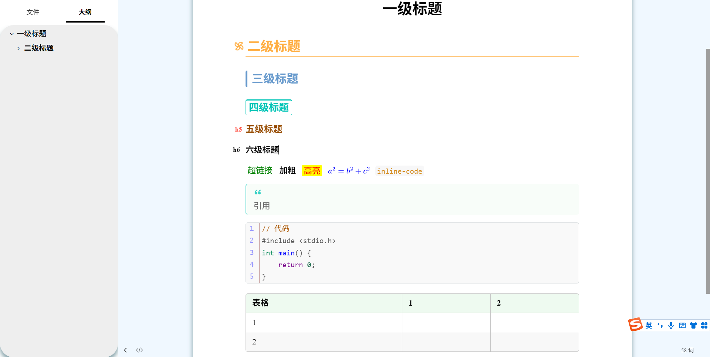
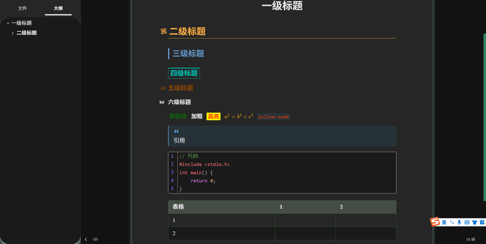
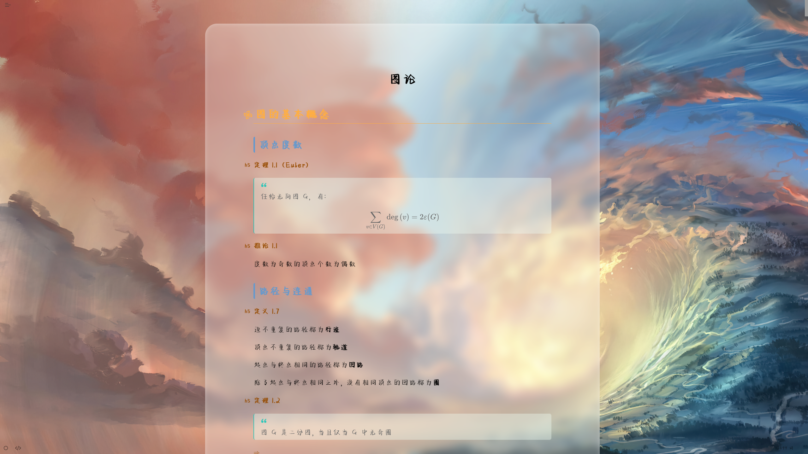
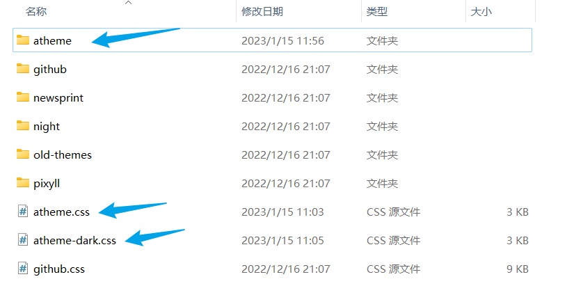

# Atheme

> 一份优雅的 typora 主题

## 前言

本主题在 dyzj 主题基础上修改得到，原主题链接：[Typora主题css样式 (github.com)](https://github.com/muggledy/typora-dyzj-theme)

## 效果预览

#### 正常模式

#### 夜间模式

#### 炫酷模式

## 使用方法

1. 下载源码，地址：[liano3/Atheme:(github.com)](https://github.com/liano3/Typora-Atheme/archive/refs/heads/main.zip)
2. 解压压缩包，得到文件夹 atheme，文件 atheme.css、atheme-dark.css
3. 把上面的文件夹 `atheme`，文件 `atheme.css`, `atheme-dark.css`, `handwrite.css` 全部放入 typora 主题文件夹(文件->偏好设置->外观->打开主题文件夹)

4. 安装 `atheme/fonts` 文件夹下的所有字体(全选，右键安装)

5. 重启typora，更换主题(Atheme或Atheme-dark或Handwrite)
